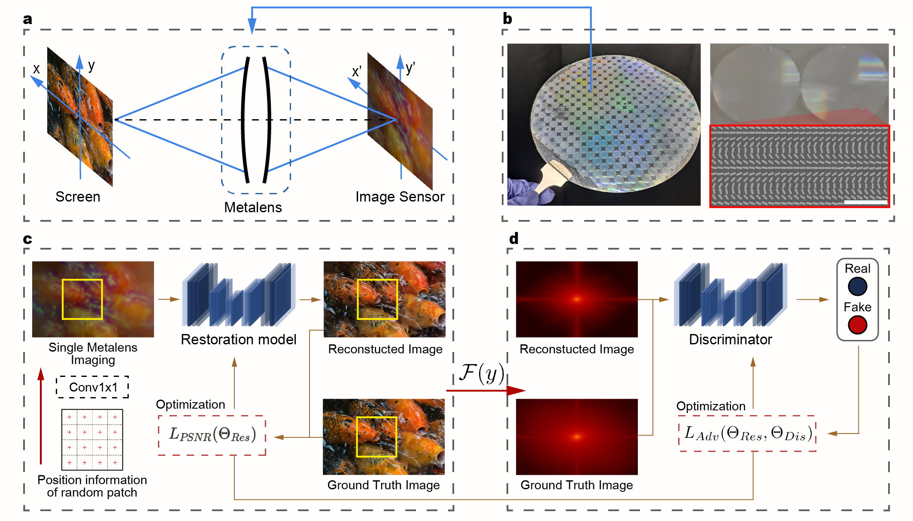
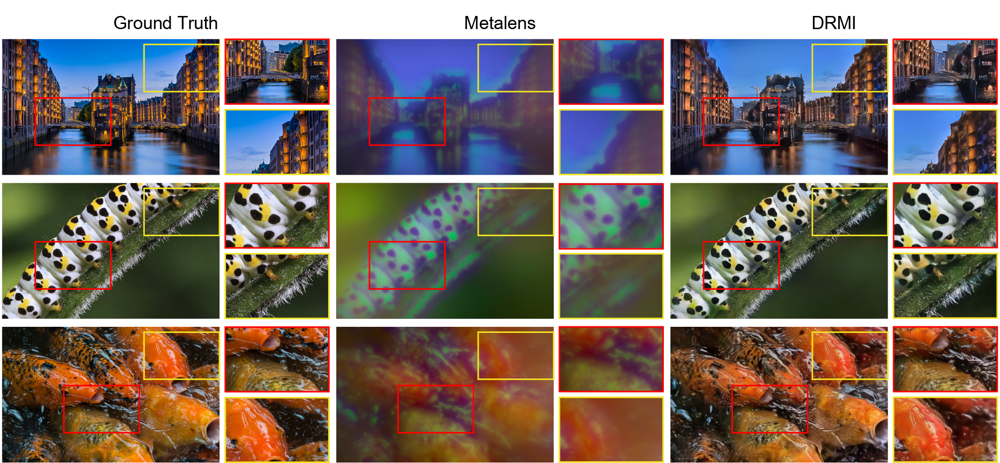

<div align="center">
<h1> Deep learning-assisted end-to-end metalens imaging </h1>
<h3> DRMI : DNN-based image Reconstruction framework customized for Metalens Imaging system </h3>

Joonhyuk Seo<sup>1,✢</sup>,
Jaegang Jo<sup>2,✢</sup>,
[Joohoon Kim](https://scholar.google.com/citations?hl=en&user=tRNVtewAAAAJ)<sup>3,✢</sup>,
Joonho Kang<sup>2,</sup>, 
[Haejun Chung](https://scholar.google.com/citations?user=O-oZnIwAAAAJ)<sup>2,📧</sup>,
[Junsuk Rho](https://scholar.google.com/citations?user=jdNQRH8AAAAJ)<sup>3,📧</sup>,
[Jehyung Hong](https://scholar.google.com/citations?user=7axCcBkAAAAJ)<sup>2,📧</sup>,

<sup>1</sup> Department of Artificial Intelligence, Hanyang University\
<sup>2</sup> Department of Electronic Engineering, Hanyang University\
<sup>3</sup> Department of Mechanical Engineering, Pohang University of Science and Technology (POSTECH)

(✢) Equal contribution.
(📧) corresponding author.

<hr />

> **Abstract:** *Recent advances in metasurface lenses (metalenses) show great potential for opening a new era of compact imaging, photography, LiDAR, and VR/AR applications. However, the reported performances of manufactured broadband metalenses are still limited due to a fundamental trade-off between broadband focusing efficiency and operating bandwidth, resulting in chromatic aberrations, angular aberrations, and relatively low efficiency. Here, we demonstrate a deep learning-based image restoration framework to overcome these limitations and to realize end-to-end metalens imaging. The proposed image restoration framework achieves aberration-free full-color imaging for one of the largest mass-produced metalens (10-mm-diameter). The metalens imaging assisted by the neural network provides competitive image qualities compared to the ground truth.* 
<hr />
</div>

## Introduction




Metalenses, ultra-thin film lenses composed of subwavelength structures, have been spotlighted as a technology to overcome the limitations of conventional lenses. However, recent studies suggest that large-area broadband metalenses may suffer from a fundamental trade-off between broadband focusing efficiency and their diameter. Consequently, at present, reported broadband metalenses show chromatic aberration or low focusing efficiency over the large bandwidth, which hinders a commercialization of metalens-based compact imaging.

In this study, we propose the DNN-based image Reconstruction framework customized for Metalens Imaging system (DRMI) to overcome all these physical constraints by learning defects of the largest mass-produced metalenses (a 10-mm diameter).

## Experimental Results



#### Performance on Image Restorations Tasks
<table class="tg">
<thead>
  <tr>
    <th class="tg-c3ow" rowspan="2"> Model </th>
    <th class="tg-c3ow" colspan="3" align="center">Image Quality Metric (mean/std)</th>
    <th class="tg-c3ow" colspan="2" align="center">Frequency Measurement</th>
  </tr>
  <tr>
    <th class="tg-c3ow" colspan="1" align="center">PSNR</th>
    <th class="tg-c3ow" colspan="1" align="center">SSIM</th>
    <th class="tg-c3ow" colspan="1" align="center">LPIPS</th>
    <th class="tg-c3ow" colspan="1" align="center">MAE</th>
    <th class="tg-c3ow" colspan="1" align="center">Cosine Similarity</th>
  </tr>
</thead>
<tbody>
  <tr>
    <td class="tg-c3ow" colspan="1" align="center">Metalens</td>
    <td class="tg-c3ow" colspan="1" align="center">14.722/1.328</td>
    <td class="tg-c3ow" colspan="1" align="center">0.464/0.160</td>
    <td class="tg-c3ow" colspan="1" align="center">0.788/0.112</td>
    <td class="tg-c3ow" colspan="1" align="center">3.2805</td>
    <td class="tg-c3ow" colspan="1" align="center">0.6394</td>
  </tr>
  <tr>
    <td class="tg-c3ow" colspan="1" align="center">MIRNetV2</td>
    <td class="tg-c3ow" colspan="1" align="center">18.517/1.893</td>
    <td class="tg-c3ow" colspan="1" align="center">0.586/0.135</td>
    <td class="tg-c3ow" colspan="1" align="center">0.553/0.098</td>
    <td class="tg-c3ow" colspan="1" align="center">2.2403</td>
    <td class="tg-c3ow" colspan="1" align="center">0.6445</td>
  </tr>
  <tr>
    <td class="tg-c3ow" colspan="1" align="center">SFNet</td>
    <td class="tg-c3ow" colspan="1" align="center">18.231/1.727</td>
    <td class="tg-c3ow" colspan="1" align="center">0.597/0.129</td>
    <td class="tg-c3ow" colspan="1" align="center">0.520/0.095</td>
    <td class="tg-c3ow" colspan="1" align="center">2.1941</td>
    <td class="tg-c3ow" colspan="1" align="center">0.6460</td>
  </tr>
  <tr>
    <td class="tg-c3ow" colspan="1" align="center">HINet(Local)</td>
    <td class="tg-c3ow" colspan="1" align="center">21.400/2.333</td>
    <td class="tg-c3ow" colspan="1" align="center">0.674/0.117</td>
    <td class="tg-c3ow" colspan="1" align="center">0.449/0.097</td>
    <td class="tg-c3ow" colspan="1" align="center">1.8508</td>
    <td class="tg-c3ow" colspan="1" align="center">0.6563</td>
  </tr>
  <tr>
    <td class="tg-c3ow" colspan="1" align="center">NAFNet</td>
    <td class="tg-c3ow" colspan="1" align="center">21.731/2.382</td>
    <td class="tg-c3ow" colspan="1" align="center">0.676/0.116</td>
    <td class="tg-c3ow" colspan="1" align="center">0.436/0.097</td>
    <td class="tg-c3ow" colspan="1" align="center">1.8165</td>
    <td class="tg-c3ow" colspan="1" align="center">0.6555</td>
  </tr>
  <tr>
    <td class="tg-c3ow" colspan="1" align="center">DRMI</td>
    <td class="tg-c3ow" colspan="1" align="center">22.109/2.423</td>
    <td class="tg-c3ow" colspan="1" align="center">0.691/0.109</td>
    <td class="tg-c3ow" colspan="1" align="center">0.428/0.096</td>
    <td class="tg-c3ow" colspan="1" align="center">1.7585</td>
    <td class="tg-c3ow" colspan="1" align="center">0.6589</td>
</tr>
</tbody>
</table>

## Installation
1. Download our repository
```bash
git clone https://github.com/yhy258/EIDL_DRMI.git
cd EIDL_DRMI
```

2. Create conda environment
```bash
conda create -n DRMI
conda activate DRMI
```

3. Install requirements.txt
```bash
conda env create -f env.yml
```

## Data preparation
Our metalens dataset used in the paper can be accessed on [Google drive](https://drive.google.com/drive/folders/1IuXorBlklxs4w-iCFsSWbN2v0CchJH68?usp=sharing).

The train-test data should be placed in  data/DRMI_dataset/{train or test} directory. :
```
EIDL_DRMI (repository)
└───data
      └───DRMI_dataset
            ├───train
            │   ├───ground_truth.lmdb
            │   └───meta.lmdb  
            └───test
                ├───ground_truth.lmdb
                └───meta.lmdb 
```

The pretrained DRMI weights used in the paper can be accessed on [Google Drive](https://drive.google.com/file/d/1Myy1bf1gRYKIqpum4a7nJsWrsjmDD-RS/view?usp=sharing).

The checkpoint should be placed in save_model/{model_type} directory. : (model_type == DRMI)
```
EIDL_DRMI (repository)
└───save_model
      └───DRMI
            └───coord_fourier_adv_model_7500.pt
```


